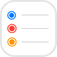

# 🔮 PermissionWizard

[](https://cocoapods.org/pods/PermissionWizard)


It is an ultimate tool for system permissions management. No longer you have to understand system API of each new permission type or search it on the Stack Overflow. 😄

## Advantages

📱 Supports the newest features of **iOS 14** and **macOS 11 Big Sur**
<br/>
🖥 Works great with **Mac Catalyst**

✋ Supports **all existing permission types**
<br/>
🛡 Provides crash free by **validating your plist** keys
<br/>
📬 Use **completion blocks** even where it is not provided by default system API
<br/>
🛣 Forget about **thread management** by using any preferred dispatch queue only (optional)

🚀 Completely written in **Swift**
<br/>
🍭 Unifies your code **regardless of permission types** you are working with
<br/>
🖼 Includes **native icons** and **string constants** for your UI (optional)
<br/>
🍕 Modular, add to your project **what you need only**
<br/>
🪁 Does not contain anything redundant

## Supported Types

               

## Requirements

- iOS 10 / macOS 10.15 Catalina
- Xcode 12.2
- Swift 5

## Installation

### [CocoaPods](https://cocoapods.org)

To integrate **PermissionWizard** into your Xcode project, add it to your `Podfile`:

```ruby
pod 'PermissionWizard'
```

By default, the library will be installed fully.

Due to Apple’s policy regarding system permissions, your app may be rejected due to mention of API that is not actually used. It is recommended to install only components that you need. In this case you will not have any troubles. ⚠️

```ruby
pod 'PermissionWizard/Icons' # Permission type icons
pod 'PermissionWizard/Bluetooth'
pod 'PermissionWizard/Calendars'
pod 'PermissionWizard/Camera'
pod 'PermissionWizard/Contacts'
pod 'PermissionWizard/FaceID'
pod 'PermissionWizard/Health'
pod 'PermissionWizard/Home'
pod 'PermissionWizard/LocalNetwork'
pod 'PermissionWizard/Location'
pod 'PermissionWizard/Microphone'
pod 'PermissionWizard/Motion'
pod 'PermissionWizard/Music'
pod 'PermissionWizard/Notifications'
pod 'PermissionWizard/Photos'
pod 'PermissionWizard/Reminders'
pod 'PermissionWizard/SpeechRecognition'
```

Do not specify `pod 'PermissionWizard'` if you install separate components.

### [Carthage](https://github.com/Carthage/Carthage)

To integrate **PermissionWizard** into your Xcode project, add it to your `Cartfile`:

```ogdl
github "debug45/PermissionWizard"
```

By default, the library is compiled fully when you build the project.

Due to Apple’s policy regarding system permissions, your app may be rejected due to mention of API that is not actually used. It is recommended to enable only components that you need. In this case you will not have any troubles. ⚠️

To enable only components that you need, create the `PermissionWizard.xcconfig` file in the root directory of your project. Put appropriate settings into the file according to the following template:

```
ENABLED_FEATURES = ICONS BLUETOOTH CALENDARS CAMERA CONTACTS FACE_ID HEALTH HOME LOCAL_NETWORK LOCATION MICROPHONE MOTION MUSIC NOTIFICATIONS PHOTOS REMINDERS SPEECH_RECOGNITION
SWIFT_ACTIVE_COMPILATION_CONDITIONS = $(inherited) $(ENABLED_FEATURES) CUSTOM_SETTINGS
```

Customize the first line of the template removing unnecessary component names.

## How to Use

Using of **PermissionWizard** is incredibly easy!

```swift
import PermissionWizard

Permission.contacts.checkStatus { status in
    status // .notDetermined
}

Permission.location.requestAccess(whenInUseOnly: true) { status in
    status.value // .whenInUseOnly
    status.isAccuracyReducing // false
}

Permission.camera.checkStatus(withMicrophone: true) { status in
    status.camera // .granted
    status.microphone // .denied
}
```

Some permission types support additional features. For example, if an iOS 14 user allows access to his location with reduced accuracy only, you can request temporary access to full accuracy:

```swift
Permission.location.requestTemporaryPreciseAccess(purposePlistKey: "Default") { result in
    result // true
}
```

Unfortunately, the ability to work with certain permission types is limited by default system API. For example, you can check the current status of a local network permission by requesting it only.

### Info.plist

For each permission type you are using, Apple requires to add the corresponding string to your `Info.plist` that describes a purpose of your access requests. **PermissionWizard** can help you to find the name of a necessary plist key:

```swift
Permission.faceID.usageDescriptionPlistKey // NSFaceIDUsageDescription

Permission.health.readingUsageDescriptionPlistKey // NSHealthUpdateUsageDescription
Permission.health.writingUsageDescriptionPlistKey // NSHealthShareUsageDescription
```

If you request access to some permission using default system API but forget to edit your `Info.plist`, the app will crash. However with **PermissionWizard** the crash will not occur — you will just see an informative warning in the debugger log.

### Thread Management

In some cases default system API may return a result in a different dispatch queue. Instead of risking a crash and using `DispatchQueue.main.async`, you can ask **PermissionWizard** to always invoke completion blocks in a preferred queue:

```swift
Permission.preferredQueue = .main // Default setting
```

### UI Assets

If your UI needs permission type icons or string names, you can easily get it using **PermissionWizard**:

```swift
let permission = Permission.speechRecognition.self
imageView.image = permission.icon

titleLabel.text = permission.titleName // Speech Recognition
descriptionLabel.text = "Please allow access to your \(permission.contextName)" // speech recognition
```

Keep in mind that icons are available only if the `Icons` component of **PermissionWizard** is installed (CocoaPods) or enabled (Carthage).

**PermissionWizard** provides icons without rounding and borders. If you want to get the design like in iOS system preferences, use the following code:

```swift
imageView.layer.cornerRadius = 7
imageView.clipToBounds = true

if #available(iOS 11, *), permission.shouldBorderIcon {
    imageView.layer.borderWidth = 1 / (window?.screen.scale ?? 1)
    imageView.layer.borderColor = UIColor(white: 0.898, alpha: 1).cgColor // #E5E5E5
}
```

## Known Issues

- Bluetooth permission always returns `.granted` on simulators
- Local Network permission does not work on simulators
- Microphone permission always returns `.granted` on simulators with iOS 10 or 11
- Music permission does not work on simulators with iOS 12

## Roadmap

- Add support of NFC
- Extend support of macOS (specific permission types, native icons)
- Make the library compatible with Swift Package Manager
- Localize string assets to all system languages
- Document the library API

## Conclusion

You can contact me on [Telegram](https://t.me/debug45) and [LinkedIn](https://linkedin.com/in/debug45). If you find an issue, please [tell](https://github.com/debug45/PermissionWizard/issues/new) about it.

Library is released under the MIT license. The permission type icons belong to Apple, their use is regulated by the company rules.

If **PermissionWizard** is useful for you please star this repository. Thank you! 👍